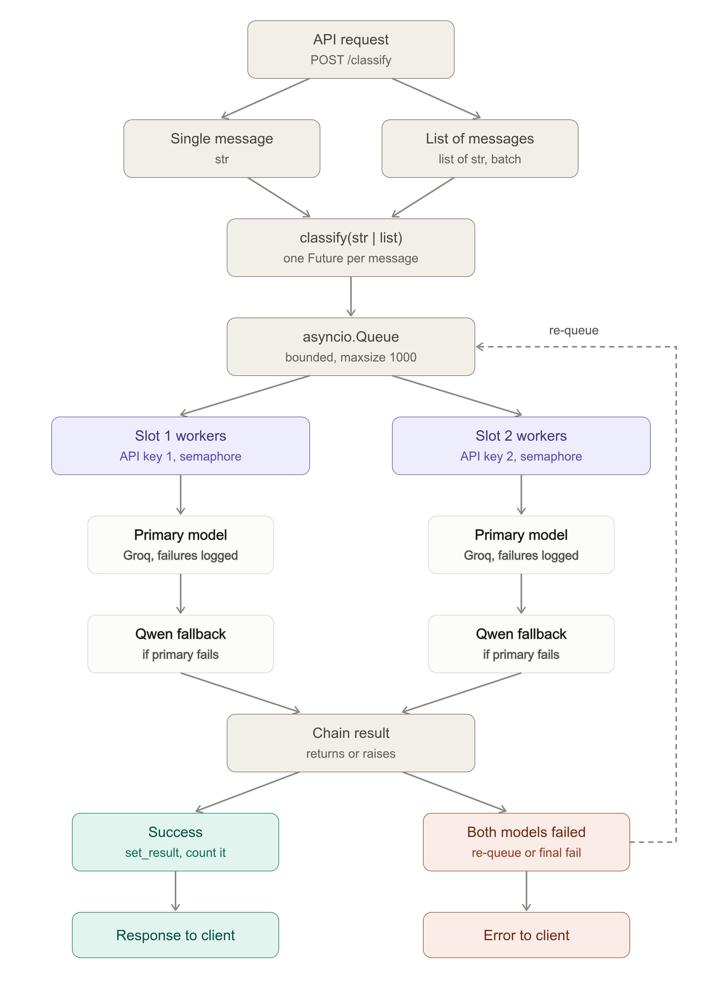

# Support Message Triage API

A small FastAPI service that classifies customer support messages using LLMs hosted on Groq. It takes a list of messages, sends them through a shared async queue, and returns a structured triage result for each one.

Built as a take-home assignment for an internship.

## What it does

- Accepts one or many support messages over a REST API.
- Uses an LLM with structured output (Pydantic schema) so every result has the same shape.
- Spreads the load across **two Groq API keys** to get more throughput and stay under rate limits.
- Falls back to a second model automatically if the primary model fails.
- Retries failed requests and records every failure so you can see what went wrong.

## How it works

<p align="center">
  
</p>


1. The API validates the messages and puts them on one shared queue.
2. Each worker slot owns one API key, a primary model, and a fallback model.
3. A worker pulls a message, calls its primary model, and uses LangChain's `with_fallbacks` to switch to the fallback model if that call fails.
4. If both models fail, the message goes back on the queue and may be picked up again (up to `max_attempts`).
5. After a cooldown, the worker's concurrency slot is released. This keeps each key under its rate limit.
6. Results come back in the same order as the input.

## Project structure

```
Project/
├──client/           # Streamlit app 
├──evals/            # Evaluation assets and pipeline
src/
├── api/             # API routes / app entry point
├── config.py        # Settings loaded from environment variables
├── prompt.py        # The triage prompt template
├── schema.py        # Pydantic models (TriageResult, TriageRequest)
├── triage_queue.py  # Queue, workers, fallback and failure tracking
└── main.py          # Main File Starting
```

<!-- TODO: adjust the tree above to match your actual folders -->

## Setup

### Requirements

- Python 3.10+
- [uv](https://docs.astral.sh/uv/)
- Two Groq API keys *(one key is enough to try the application; the second is used by the second worker for parallel processing/fallback)*

```bash
# 1. Clone the repository
git clone https://github.com/anishpandey7659/Take-Home-Project-AI-Support-Ticket-Triage.git

# 2. Enter the project
cd Take-Home-Project-AI-Support-Ticket-Triage

# 3. Create the virtual environment and install dependencies
uv sync

# 4. Activate the virtual environment
source .venv/bin/activate
```

### Configuration

Create a `.env` file in the project root:

```env
GROQ_API_KEY=your_first_key
GROQ_API_KEY2=your_second_key

GROQ_MODEL=<primary model for worker-1>
GROQ_MODEL2=<primary model for worker-2>
FALLBACK_MODEL1=<fallback model for worker-1>
FALLBACK_MODEL2=<fallback model for worker-2>

DEFAULT_TEMPERATURE=0
MAX_CONCURRENCY=2
COOLDOWN=1.0
MAX_ATTEMPTS=3
```

<!-- TODO: make sure these names match the fields in src/config.py -->

| Setting | Meaning |
|---|---|
| `GROQ_API_KEY`, `GROQ_API_KEY2` | One API key per worker |
| `GROQ_MODEL`, `GROQ_MODEL2` | Primary model used by each worker |
| `FALLBACK_MODEL1`, `FALLBACK_MODEL2` | Model used if the primary fails |
| `DEFAULT_TEMPERATURE` | LLM temperature (low = more consistent labels) |
| `MAX_CONCURRENCY` | Parallel calls allowed per worker |
| `COOLDOWN` | Seconds before a worker slot is freed after a call |
| `MAX_ATTEMPTS` | How many times a message is tried before it fails |

## Running

**Start the API:**

```bash
uvicorn src.main:app --reload
```

<!-- TODO: replace src.main:app with your actual app path -->

Interactive docs are available at `http://localhost:8000/docs`.

**Quick test without the API** (runs the queue directly on a few sample messages):

```bash
python -m src.triage_queue
```

## API

### `POST /triage_all`

Classifies a list of support messages. Results are returned in the same order as the input.

**Request**

```json
[
  { "message": "I was charged twice for my subscription this month." },
  { "message": "The app crashes every time I try to upload a photo." }
]
```

**Response** `200 OK`

A list of `TriageResult` objects, one per message (see `src/schema.py` for the exact fields).

**Errors**

| Status | When |
|---|---|
| `422` | A message is blank |
| `502` | The LLM failed on a message after all retries |


## Prompt Engineering

The triage system uses a structured prompt to classify each customer support message across urgency, category, and sentiment, while also generating a concise suggested reply.

The prompt was designed to make the classification criteria explicit, reduce ambiguity between similar labels, and prevent the model from inferring information that is not present in the customer's message.

<summary><strong>View full production prompt</strong></summary>

```text
PROMPT= ChatPromptTemplate.from_messages(
    [
        (
            "system",
"""
You are a customer support triage assistant.

Your task is to analyze a customer support message and return a structured classification and a suggested reply.

You must produce:

1. urgency
2. category
3. sentiment
4. suggested_reply


URGENCY:
- Critical: An active or already-occurred situation involving:
  - Account compromise or unauthorized access.
  - Data loss or exposure, including data reported as missing, deleted, or gone. Treat the customer's statement as sufficient; do not require proof of the cause.
  - Unauthorized charges from an unknown/unrecognized source, or severe/escalating financial loss.
  - Failed safety-critical alerts/reminders that caused or are causing risk or harm.
  - Service-wide or team-wide outage or unusability affecting multiple users.
- High: A needed feature or action is blocked, or there is a clear deadline or significant business impact. A workaround makes it Medium unless a deadline or significant business impact exists. This includes known-source billing disputes such as duplicate, incorrect, or continued charges after cancellation.
- Medium: A problem or request needs support action but does not currently block the customer, including performance issues, bugs with a workaround, delayed notifications, or settings changes.
- Low: Feature requests, suggestions, how-to/where-to-find questions, general questions, or cosmetic issues with no impact on use.

CATEGORY:
- Billing: Payments, charges, refunds, invoices, subscriptions, cancellations of paid plans, or pricing.
- Technical: Bugs, crashes, errors, broken features, performance problems, or other technical malfunctions of the app. Also includes questions about how a feature works when the question is primarily about its technical behavior.
- Account: Login, password, account access/settings, profile management, permissions, roles, caregivers, members, or accessing/managing account information, health records, or shared information.
- Feedback: Suggestions, product feedback, complaints, or compliments.
- Other: Does not clearly fit another category.

SENTIMENT:
- Angry: Strong hostility, aggression, or condemnation toward the company, service, or situation, including explicit blame, insults, profanity, threats, ultimatums, aggressive demands, strong outrage, or statements such as "this is unacceptable."
- Frustrated: Clear or implied dissatisfaction, annoyance, disappointment, worry, or distress about a problem or inconvenience. A repeated problem or delay alone does not imply frustration.
- Neutral: Factual, informational, or task-focused language without clear emotion, including routine questions, requests, and straightforward problem reports. Do not infer Frustrated or Angry solely from seriousness, urgency, or a negative outcome.
- Happy: Clear positive emotion such as satisfaction, praise, appreciation, gratitude, or excitement. Simple politeness, routine "thanks", or courteous language alone is not enough to classify a message as Happy.

SUGGESTED REPLY:
- Match the customer's sentiment; be concise, professional, empathetic, and grounded in the message.
- Do not promise refunds, credits, compensation, resolution times, or actions unless explicitly established.
- If additional information is needed, ask only for the minimum relevant details.

IMPORTANT RULES:
- Use only explicitly stated information; never invent or assume account details, policies, refunds, compensation, timelines, actions, or technical facts.
- Emotional tone must not raise urgency; judge urgency by impact only.
- If both Critical and High apply, choose Critical.
- If Angry and Frustrated both apply, choose Angry when explicit hostility, blame, aggression, or confrontational demands are present.
- Return exactly one value for each classification field.
- Do not claim an action has already been performed.

""",
        ),
        (
            "human",
            """
Customer message:

{message}
            """,
        ),
    ]
)


```

## Prompt Tuning

- **Requirement Analysis:** Read the problem requirements and converted them into a clear rubric covering **urgency, category, sentiment, and suggested reply**.

- **Initial Prompt:** Created the first prompt using the rubric, with explicit definitions and rules for each label.

- **Golden Dataset:** Reviewed all **20 provided support messages** and, with the help of AI, created a **golden dataset** containing the expected labels for each message.

- **Evaluation Pipeline:** Built an evaluation pipeline using the golden dataset to measure prompt performance with **precision, recall, and confusion matrices**.

- **Error Analysis:** Identified common classification issues, particularly confusion between **High vs. Critical** urgency and **Angry vs. Frustrated** sentiment.

- **Prompt Iteration:** Refined ambiguous definitions and added clearer decision rules based on the evaluation results.

- **Continuous Evaluation:** Re-ran the evaluation after each prompt change, analyzed the results, and repeated the process to improve **classification accuracy and consistency**.

##  Tech Stack
- Frontend: Streamlit — deployed on Streamlit Community Cloud
- Backend: FastAPI — deployed on Vercel
- AI/LLM: LangChain + Groq
- Validation: Pydantic
- Language: Python
- Evaluation: Custom evaluation metrics
- Deployment: Vercel + Streamlit Community Cloud